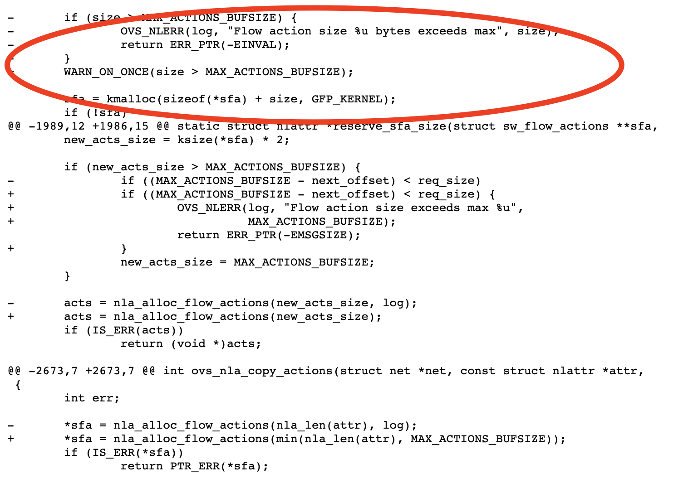

# 问题

这是前几天我们碰到的一个问题，问题的发生是因为发现Private network网络不通了。

然后看到ovs有如下的错误日志：

```shell
[1126088.247462] openvswitch: netlink: Flow action size 32780 bytes exceeds max
```

# OVS Flow

通常一条OVS Flow会由对象（五元组，vlan tag，vxlan id）+ N个action组成。action是需要采取的动作。

比如下面这条flow（`ovs-ofctl dump-flows br-tun`）这里的action是要把vlan tag 40转为tun id 60129，然后要把这个广播出去，因为所有的Hypervisor之间两两都有vxlan的tunnel，所以相当于要向所有的output广播。hypervisor的数目越多，这里的output就越多。

值得一提的，虽然output是所有hypervisor，但是并不是所有hypervisor上都有这样一条flow。只有在controller节点上（因为有neutron services，比如dhcp啥的），以及有private vm存在的compute节点上才存在这样一条flow。

```mysql
select * from ml2_vxlan_endpoints
```

```shell
cookie=0x92889808aecb4eb0, duration=249122.108s, table=22, n_packets=0, n_bytes=0, idle_age=65534, hard_age=65534, dl_vlan=40 actions=strip_vlan,set_tunnel:0xeae1,output:554,output:540,output:556,output:553,output:559,output:558,output:541,output:356,output:378,output:396,output:214,output:465,output:499,output:477,output:479,output:25,output:41,output:469,output:453,output:53,output:37,output:50,output:39,output:38,output:47,output:29,output:42,output:569,output:567,output:536,output:522,output:521,output:520,output:528,output:577,output:582,output:578,output:268,output:278,output:287,output:284,output:297,output:10,output:35,output:6,output:14,output:15,output:13,output:40,output:8,output:2,output:3,output:227,output:221,output:217,output:203,output:201,output:226,output:206,output:228,output:289,output:286,output:158,output:147,output:160,output:152,output:291,output:165,output:157,output:146,output:166,output:151,output:89,output:81,output:77,output:86,output:88,output:85,output:84,output:83,output:87,output:95,output:283,output:281,output:329,output:307,output:319,output:325,output:318,output:316,output:306,output:301,output:296,output:265,output:277,output:298,output:273,output:475,output:445,output:441,output:462,output:476,output:463,output:472,output:478,output:449,output:450,output:464,output:495,output:360,output:355,output:411,output:410,output:370,output:358,output:365,output:367,output:430,output:434,output:431,output:436,output:417,output:427,output:421,output:419,output:535,output:532,output:539,output:232,output:237,output:235,output:236,output:230,output:534,output:394,output:438,output:116,output:118,output:134,output:110,output:109,output:106,output:107,output:120,output:189,output:111,output:112,output:119,output:132,output:127,output:114,output:108,output:117,output:105,output:99,output:115,output:76,output:187,output:179,output:170,output:171,output:176,output:383,output:372,output:345,output:344,output:337,output:348,output:341,output:380,output:375,output:418,output:413,output:428,output:426,output:470,output:437,output:433,output:432,output:57,output:54,output:56,output:467,output:60,output:58,output:62,output:59,output:586,output:576,output:573,output:574,output:575,output:571,output:580,output:570,output:584,output:583,output:564,output:542,output:560,output:563,output:548,output:555,output:545,output:552,output:544,output:562,output:299,output:267,output:256,output:255,output:253,output:300,output:274,output:254,output:295,output:261,output:218,output:225,output:190,output:197,output:223,output:204,output:202,output:191,output:192,output:354,output:340,output:346,output:280,output:336,output:480,output:461,output:482,output:447,output:292,output:285,output:272,output:270,output:484,output:473,output:481,output:455,output:460,output:488,output:491,output:502,output:19,output:23,output:16,output:30,output:18,output:32,output:11,output:22,output:45,output:28,output:572,output:579,output:581,output:585,output:568,output:363,output:402,output:379,output:369,output:404,output:403,output:397,output:399,output:407,output:393,output:279,output:293,output:144,output:137,output:257,output:263,output:290,output:188,output:182,output:185,output:168,output:172,output:186,output:161,output:184,output:173,output:181,output:248,output:242,output:250,output:244,output:241,output:249,output:238,output:231,output:234,output:233,output:485,output:317,output:312,output:331,output:334,output:200,output:220,output:339,output:349,output:213,output:198,output:222,output:224,output:219,output:210,output:517,output:503,output:386,output:388,output:92,output:69,output:65,output:67,output:64,output:63,output:68,output:72,output:70,output:71,output:505,output:512,output:385,output:309,output:332,output:333,output:313,output:320,output:303,output:314,output:323,output:381,output:315,output:310,output:408,output:550,output:546,output:377,output:561,output:557,output:566,output:361,output:551,output:543,output:547,output:549,output:74,output:359,output:518,output:511,output:444,output:439,output:506,output:516,output:443,output:458,output:442,output:489,output:446,output:448,output:456,output:466,output:406,output:193,output:194,output:215,output:216,output:177,output:174,output:154,output:150,output:163,output:178,output:148,output:155,output:183,output:180,output:371,output:391,output:368,output:389,output:373,output:382,output:366,output:398,output:357,output:384,output:565,output:208,output:471,output:440,output:493,output:468,output:474,output:459,output:500,output:457,output:501,output:486,output:26,output:48,output:52,output:44,output:34,output:33,output:24,output:51,output:46,output:36,output:400,output:405,output:376,output:401,output:387,output:409,output:390,output:395,output:392,output:425,output:537,output:130,output:141,output:139,output:123,output:143,output:136,output:131,output:135,output:258,output:140,output:138,output:483,output:492,output:498,output:519,output:494,output:490,output:487,output:451,output:497,output:496,output:269,output:452,output:5,output:4,output:240,output:246,output:247,output:245,output:243,output:251,output:252,output:239,output:264,output:288,output:20,output:49,output:12,output:7,output:43,output:31,output:9,output:21,output:27,output:17,output:199,output:196,output:207,output:211,output:195,output:229,output:205,output:209,output:212,output:80,output:66,output:78,output:73,output:75,output:91,output:82,output:61,output:90,output:79,output:525,output:524,output:531,output:538,output:530,output:526,output:523,output:529,output:527,output:533,output:308,output:305,output:311,output:322,output:328,output:330,output:321,output:324,output:326,output:327,output:514,output:454,output:513,output:266,output:276,output:260,output:55,output:259,output:294,output:271,output:262,output:275,output:282,output:416,output:424,output:507,output:508,output:509,output:515,output:504,output:510,output:423,output:422,output:412,output:420,output:414,output:435,output:415,output:429,output:142,output:133,output:124,output:128,output:129,output:126,output:125,output:121,output:113,output:122,output:103,output:101,output:97,output:98,output:100,output:102,output:93,output:104,output:94,output:96,output:167,output:156,output:169,output:149,output:159,output:164,output:153,output:145,output:162,output:175
```

对于单条flow的size有个limit，是

```c
#define MAX_ACTIONS_BUFSIZE	(32 * 1024)
```

> For example, for a vxlan output action, we need about 60 bytes for the nlattr, but after it is converted to the flow action, it only occupies 24 bytes.

这里的每个`out:175`，都是一个ntattr（大概需要60 bytes），而放到flow action了之后还有个转换的过程到实际的flow（`ovs-dpctl dump-flows`）转换过后就只需要24 bytes了，那么其实应该是可以支持到 （32 * 1024）/ 24 = 1365个左右的hypervisor，可是我们在500多hypervisor的时候就碰到问题了

这个有个bug



红色部分的size是转换之前按ntattr原始长度计算的，按原始长度来算的话，只能支持到（32 * 1024）/ 60 = 546.13，而我们环境hypervisor有579台，所以原来我们在这边就返回错误了。

bug更新之后，会根据24 bytes来计算是否超过限制。

# References

[1] [https://mail.openvswitch.org/pipermail/ovs-dev/2018-February/344262.html](https://mail.openvswitch.org/pipermail/ovs-dev/2018-February/344262.html)

