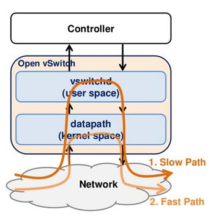

# OVS Flow action size超限制问题又现

没想到这个问题[OVS Flow action size超限制](https://lrainsun.github.io/2020/03/17/openstack-ovs-action-flow-limit/)竟卷土重来，当我们上次编译了openvswitch代码并且apply并重启了neutron openvswitch agent之后，发现又产生了这个问题。

这部分代码是在openvswitch kernel module里的，所以上次的patch就没有生效。

# kernel module编译

这就需要编译kernel module

首先需要下载并安装对应版本的kernel-devel包（kernel-devel包只包含用于内核开发环境所需的内核头文件以及Makefile），比如我们要编译的版本是`3.10.0-957.12.2.el7`

```shell
wget http://repo1.xorcom.com/repos/centos/7/x86_64/Updates_OS_X86_64/Packages/k/kernel-devel-3.10.0-957.12.2.el7.x86_64.rpm
rpm -ivh kernel-devel-3.10.0-957.12.2.el7.x86_64.rpm
```

解压后的代码会被放在这里

```shell
[root@rain-working-vm kernel]# cd /usr/src/kernels/3.10.0-957.12.2.el7.x86_64/
arch/           crypto/         fs/             ipc/            lib/            mm/             samples/        sound/          usr/
block/          drivers/        include/        Kconfig         Makefile        Module.symvers  scripts/        System.map      virt/
.config         firmware/       init/           kernel/         Makefile.qlock  net/            security/       tools/          vmlinux.id
```

openvswitch相关在这里

```shell
[root@rain-working-vm 3.10.0-957.12.2.el7.x86_64]# ls -al net/openvswitch/
total 12
drwxr-xr-x.  2 root root   35 Mar 27 14:42 .
drwxr-xr-x. 61 root root 4096 Mar 27 14:02 ..
-rw-r--r--.  1 root root 2295 May 14  2019 Kconfig
-rw-r--r--.  1 root root  446 May 14  2019 Makefile
```

可以拷贝这个文件夹到任意地方，并把openvswitch代码放到这里，就可以编译了

```shell
[root@rain-working-vm openvswitch]# cp /home/ocp/openvswitch-2.5.0-14/openvswitch-2.5.0/datapath/* .
cp: omitting directory ‘/home/ocp/openvswitch-2.5.0-14/openvswitch-2.5.0/datapath/linux’
[root@rain-working-vm openvswitch]# ls
actions.c    conntrack.h  dp_notify.c  flow_netlink.c  flow_table.h  Makefile.am  README.md  vport-geneve.c  vport-internal_dev.c  vport-netdev.c  vport-vxlan.c
compat.h     datapath.c   flow.c       flow_netlink.h  Kconfig       Makefile.in  vlan.h     vport-gre.c     vport-internal_dev.h  vport-netdev.h
conntrack.c  datapath.h   flow.h       flow_table.c    Makefile      Modules.mk   vport.c    vport.h         vport-lisp.c          vport-stt.c
```

 此外，为了解决load module时的问题

```shell
[62972.099953] openvswitch: no symbol version for module_layout
```

还需要将如下文件（就在kernel-devel包里，拷贝到我们编译目录下）

```shell
[root@rain-working-vm openvswitch]# cp /usr/src/kernels/3.10.0-957.12.2.el7.x86_64/Module.symvers .
```

```shell
[root@rain-working-vm 3.10.0-957.12.2.el7.x86_64]# make modules M=/root/openvswitch
arch/x86/Makefile:166: *** CONFIG_RETPOLINE=y, but not supported by the compiler. Compiler update recommended..  Stop.
```

555，好像我的gcc版本太低，太晚了我困了，明天搞定再更新

# 问题验证

用了比较蠢的方法，我们通过往数据库表`ml2_vxlan_endpoints`里插入记录，来制造多hypervisor的情况

```mysql
insert into ml2_vxlan_endpoints (ip_address,udp_port,host) values ("192.168.0.50",4789,"ci81hf1cmp050.qa.webex.com");
```

上一篇里面讲到到500多的时候会触发那个bug，我们就尝试复现一下这个问题，最终成功复现并且得到了准确的数据。

在585个endpoint的时候（controller/network node, compute node），还不会触发这个问题

到586的时候，就已经超过限制。所以在没打patch之前，585是最大可支持的hypervisor数。

## slow path

上次算的时候，理论上打过patch之后，可以支持到1300+的hypervisor，可是我们实际测试下来并不是这样。

令人费解的是，当我们endpoint达到1300+的时候，datapath反而是通的了。后来发现，虽然在control层（`ovs-ofctl dump-flows br-tun`）我们查到了output广播的那条flow，但是在实际data path的flow（`ovs-dpctl dump-flows`）中并没有看到对应的flow。

后来在data flow中看到了这样的信息

```shell
recirc_id(0),in_port(8),eth(src=fa:16:3e:37:d9:88,dst=ff:ff:ff:ff:ff:ff),eth_type(0x0806),arp(sip=10.0.0.14,tip=10.0.0.6,op=1/0xff), packets:3, bytes:126, used:0.679s, actions:userspace(pid=4294951940,slow_path(action))
```

查了一下，发现是这样



OVS是内核态和用户态配合工作的，需要加载内核态模块Openvswitch.ko。

datapath 运行在内核态，ovs-vswitchd 运行在用户态，两者通过netlink 通信。

netlink 是一种灵活和强大的进程间通信机制（socket），甚至可以沟通用户态和内核态。

netlink 是全双工的。作为socket，netlink 的地址族是AF_NETLINK（TCP/IP socket 的地址族是AF_INET）

* Slow Path:
  * 当Datapath找不到flow rule对packet进行处理时
  * Vswitchd使用flow rule对packet进行处理。
* Fast Path:
  * 将slow path的flow rule放在内核态，对packet进行处理

很明显，slow path是在vswitchd进行处理，而fast path是在内核态进行处理，这个速度的差距可想而知。而从上面的打印可以看到，我们的广播包在超过1300+节点的时候，被处理成slow path了，所以根本都没有放到data path kernel的flow里面去。那为啥会被处理成slow path呢？

这里有段代码

xlate_actions(struct xlate_in *xin, struct xlate_out *xout)时

```c
    if (nl_attr_oversized(ctx.odp_actions->size)) {
        /* These datapath actions are too big for a Netlink attribute, so we
         * can't hand them to the kernel directly.  dpif_execute() can execute
         * them one by one with help, so just mark the result as SLOW_ACTION to
         * prevent the flow from being installed. */
        COVERAGE_INC(xlate_actions_oversize);
        ctx.xout->slow |= SLOW_ACTION;
    } else if (too_many_output_actions(ctx.odp_actions)) {
        COVERAGE_INC(xlate_actions_too_many_output);
        ctx.xout->slow |= SLOW_ACTION;
    }

/* Returns true if a Netlink attribute with a payload that is 'payload_size'
 * bytes long would be oversized, that is, if it's not possible to create an
 * nlattr of that size because its size wouldn't fit in the 16-bit nla_len
 * field. */
bool
nl_attr_oversized(size_t payload_size)
{
    return payload_size > UINT16_MAX - NLA_HDRLEN;
}
```

意思是这边会有个判断，如果觉得对于netlink attribute来说action长度太长了，就不会直接转给kernel，而是会one by one with help，只是把这条action置成SLOW_ACTION，这样就不会在内核加载这条flow了。

很显然，当hypervisor数目增多的时候，我们的这台flow的action size就超限了

最终我们测得的准确数值是，最大可以支持到1170台endpoint。