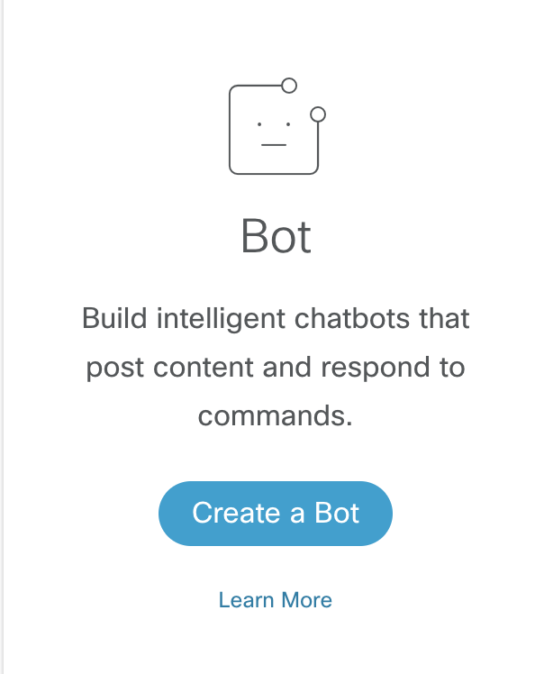
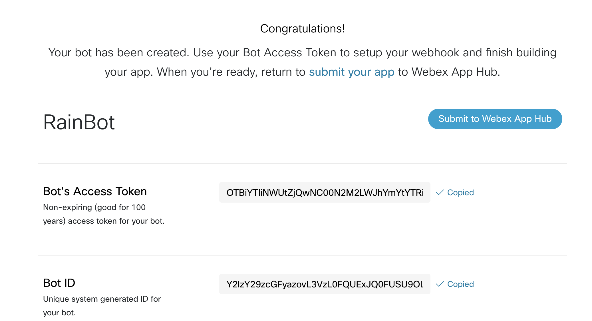
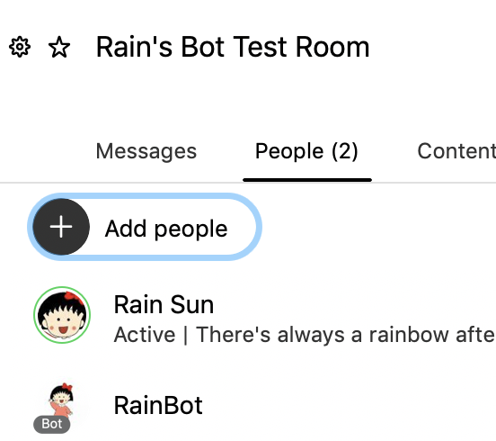
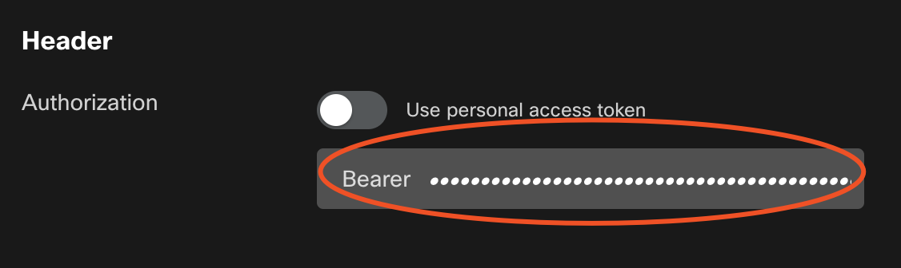
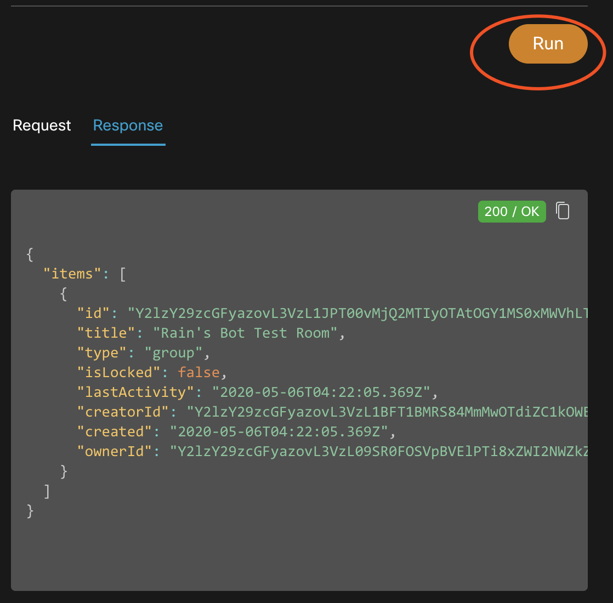
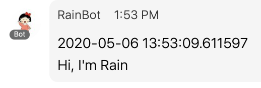

Run your own Webex Teams bot by taking a few steps:

- Create a Webex Teams bot account at [https://developer.webex.com](https://developer.webex.com/)
- Access the unique identifier of a Webex Teams Room we'll post test messages to
- Run a sample Python script under a bot identity

# 创建webex teams bot

bot就是一个可以用来运行你的自动化脚本的小机器人，我们不会用自己的webex teams账户，那么关于这个账户，可以有两种方式：

* 创建一个webex teams 'bot'账户
* 使用'incoming webhooks' integration

https://developer.webex.com/my-apps/new



创建之后，需要记录下bot access token（valid for 100 years）和bot id



然后可以建立一个room，把自己建的bot加进去，就可以用来测试了



# 获取webex team room id

访问https://developer.webex.com/docs/api/v1/rooms/list-rooms并且登录



这里bearer填写刚刚的bot access token



run之后就可以得到response，里面有room id

# Run Bot

然后我们可以在本地跑python的脚本作为bot的backend

下载示例脚本

```shell
 git clone https://github.com/CiscoDevNet/devnet-express-cloud-collab-code-samples
 cd devnet-express-cloud-collab-code-samples
 cd itp
 cd collab-spark-chatops-bot-itp
```

把依赖装上

```shell
pip install requests
```

```shell
python chatops.py -r Y2lzY29zcGFyazovL3VzL1JPT00vMjQ2MTIyOTAtOGY1MS0xMWVhLThkOTgtMzllYjc1NTJjMzU0 -t OTBiYTliNWUtZjQwNC00N2M2LWJhYmYtYTRiOTExOTk0NGY1ZTU2ZDMzODQtZTUx_PF84_1eb65fdf-9643-417f-9974-ad72cae0e10f -m "Hi, I'm Rain"
your message was successfully posted to Webex Teams
```



分析一下代码，bot的bot access token，message，room id作为参数传入

```python
        # Now let's post our message to Webex Teams
        res = send_it(token, teams_room, str(dt.datetime.now()) + "\n" + message)
```

```python
# Simple Bot Function for passing messages to a room
def send_it(token, room_id, message):

        header = {"Authorization": "Bearer %s" % token,
                  "Content-Type": "application/json"}

        data = {"roomId": room_id,
                "text": message}

        return requests.post("https://api.ciscospark.com/v1/messages/", headers=header, data=json.dumps(data), verify=True)
```

# Bot分类

* Notifiers：响应外部服务中的event，然后在webex teams中发布summary
* Controllers：充当外部服务的text-based remote control
* Assistants：类似聊天bot，需要理解自然语言，允许用户提问 

# 响应Events

我们可以使用bot access token用webex rest api来执行动作，那我们怎么能知道有人给bot发了消息，或者在room里@了bot呢？我们需要一个webhook，webhook可以让我们知道发生了什么事情，然后我们才能知道做怎样的响应

除此之外，还可以使用[card](https://developer.webex.com/docs/api/guides/cards)来实现用户跟bot/service的交互

# Bot跟People的区别

在一个room里，bot只能够对@它的消息作出响应（ `messages:created` webhooks only fire when the bot is mentioned in a room.）

list message的时候，需要加上`&mentionedPeople=me`，否则会返回503

```shell
GET https://api.ciscospark.com/v1/messages?roomId=roomid&mentionedPeople=me
```

# 发送message

刚刚event是从webex teams -> bot

那么bot -> webex teams可以发送message

> Messages are how we communicate in a room. In Webex Teams, each message is displayed on its own line along with a timestamp and sender information. Use this API to list, create, and delete messages.
>
> Message can contain plain text, [rich text](https://developer.webex.com/docs/api/basics#formatting-messages), and a [file attachment](https://developer.webex.com/docs/api/basics#message-attachments).
>
> Just like in the Webex Teams app, you must be a member of the room in order to target it with this API.

message可以发送到一个room，一个person


```shell
roomId
string
The room ID of the message.

parentId
string
The parent message to reply to.

toPersonId
string
The person ID of the recipient when sending a private 1:1 message.

toPersonEmail
string
The email address of the recipient when sending a private 1:1 message.
```

# References

[1] [https://developer.cisco.com/learning/lab/collab-spark-chatops-bot-itp/step/1](https://developer.cisco.com/learning/lab/collab-spark-chatops-bot-itp/step/1)

[2] [https://developer.webex.com/docs/bots](https://developer.webex.com/docs/bots)

