# 配置Webhooks

> A webhook is an HTTP callback, or an HTTP POST, to a specified URL that notifies your app when a particular activity or “event” has occurred in one of your resources on the Webex Teams platform.

webhook可以让我们实时地收到webex teams的消息

我们可以在这里https://developer.webex.com/docs/api/v1/webhooks，为特定的event创建一个webhook，notification会被通过http post发送，json格式，到你定义的url。这个Url必须是webe teams可达的，然后需要一个response，如果100次都没有收到2xx的response，webhook会被disable5分钟的时间

在为一个resource create webhook的时候，需要确认auth token对这个resource有read [scope](https://developer.webex.com/docs/integrations#scopes)。

## 测试环境

如果是测试用，可以在本地起一个ngrok（能够将你本机的HTTP服务（站点）或TCP服务，通过部署有ngrok服务的外网伺服器暴露给外网访问）

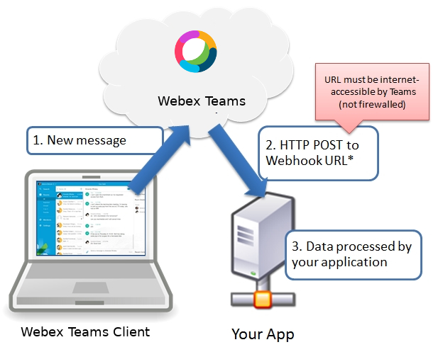

因为很多服务并不是直接接入internet with public ip的，所以我们需要：

* 创建一个local -> internet的tunnel，ngrok等工具可以充当本地服务http://localhost:port的反向代理

### 安装ngrok

下载**https://ngrok.com/download**

解压

```shell
unzip -n ngrok-stable-darwin-amd64.zip -d ~/Documents/minsu/tools
Archive:  ngrok-stable-darwin-amd64.zip
  inflating: /Users/minsu/Documents/minsu/tools/ngrok
```

启动

```shell
~/Documents/minsu/tools/ngrok http localhost:3000

ngrok by @inconshreveable                                                     (Ctrl+C to quit)

Session Status                online
Session Expires               7 hours, 59 minutes
Version                       2.3.35
Region                        United States (us)
Web Interface                 http://127.0.0.1:4040
Forwarding                    http://af4b2a4b.ngrok.io -> http://localhost:3000
Forwarding                    https://af4b2a4b.ngrok.io -> http://localhost:3000

Connections                   ttl     opn     rt1     rt5     p50     p90
                              0       0       0.00    0.00    0.00    0.00
```

访问`http://localhost:4040`查看ngrok状态

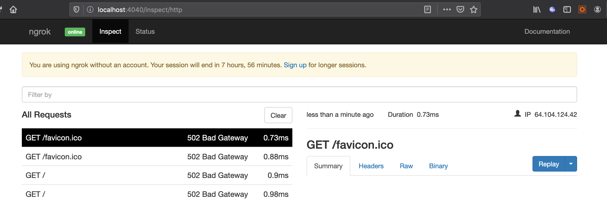

因为我们没有起后端，所以

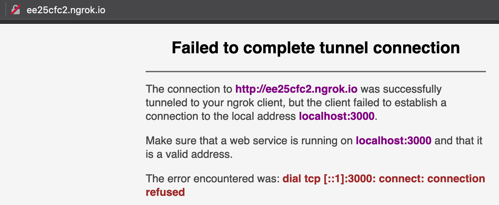

### 注册webhook

为了收到消息，我们还需要注册一个webhook

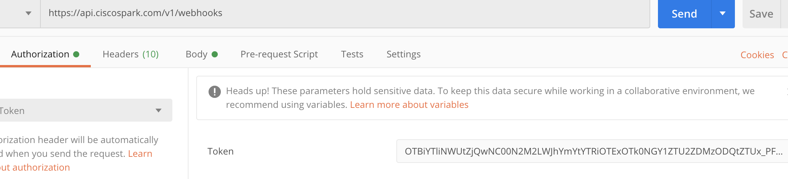

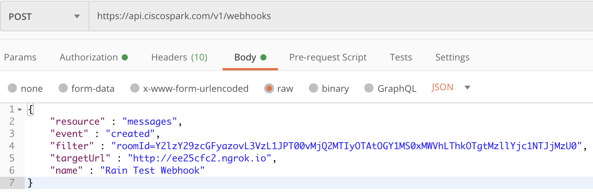

response

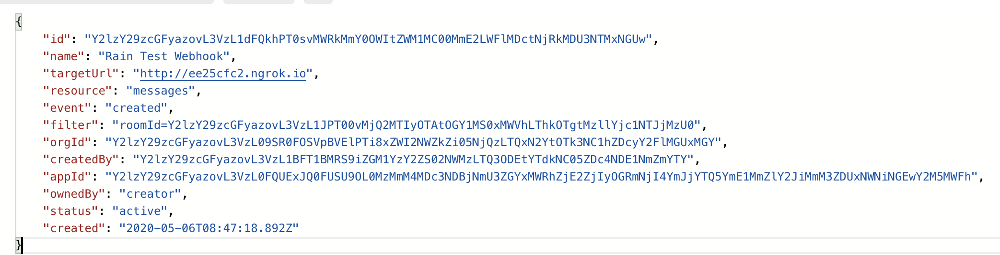

### 测试

现在我们在测试room发送一条消息

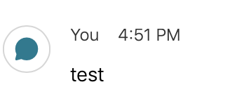

查看`http://localhost:4040/inspect/http`并没有发现有收到新消息

原来是需要@bot才可以

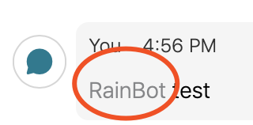

现在我们可以看到

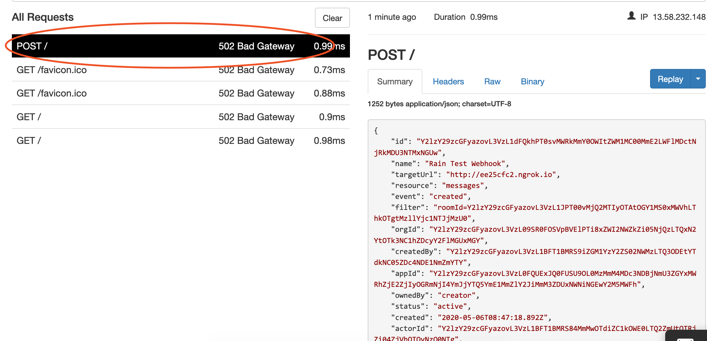

已经收到了消息，502是因为我们没有backend

在response的data里，我们可以看到message的来源，data id等

```json
    "data": {
        "id": "Y2lzY29zcGFyazovL3VzL01FU1NBR0UvNmY3NWMyMTAtOGY3Ny0xMWVhLTg3Y2QtYzc2ZTVhNjhlYzMy",
        "roomId": "Y2lzY29zcGFyazovL3VzL1JPT00vMjQ2MTIyOTAtOGY1MS0xMWVhLThkOTgtMzllYjc1NTJjMzU0",
        "roomType": "group",
        "personId": "Y2lzY29zcGFyazovL3VzL1BFT1BMRS84MmMwOTdiZC1kOWE0LTQ2ZmUtOTRjZi04ZjVhOTQyNzQ0NTg",
        "personEmail": "minsu@cisco.com",
        "mentionedPeople": [
            "Y2lzY29zcGFyazovL3VzL1BFT1BMRS9iZGM1YzY2ZS02NWMzLTQ3ODEtYTdkNC05ZDc4NDE1NmZmYTY"
        ],
        "created": "2020-05-06T08:56:12.209Z"
    }
```

而实际的message内容并不在里面，这是出于安全考虑，notification里只包含message event的metadata，并不包含message本身

为了要获取到实际的message，我们还需要通过message id call api来获取

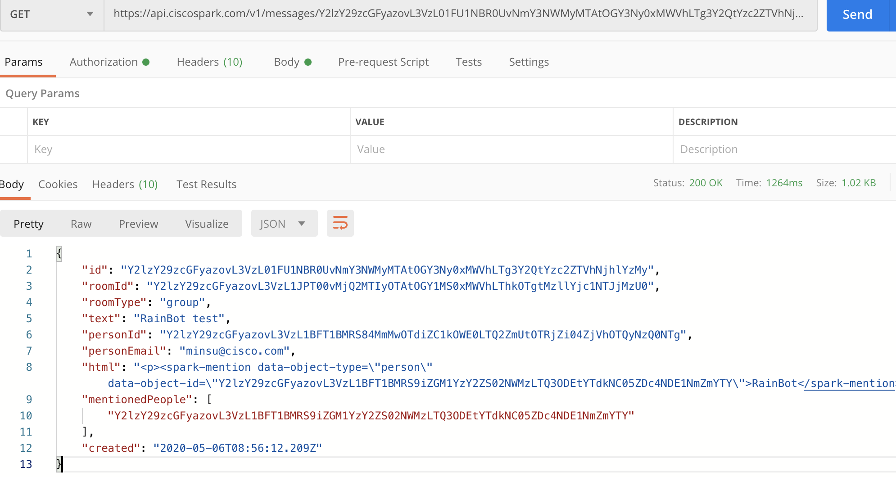

## 生产环境

可以看到我们刚刚起的ngrok是有失效时间的

```
Session Expires               7 hours, 59 minutes
```

生产环境肯定不能这样，我们可以[注册](https://dashboard.ngrok.com/signup)一个账号，通过authtoken来完成。

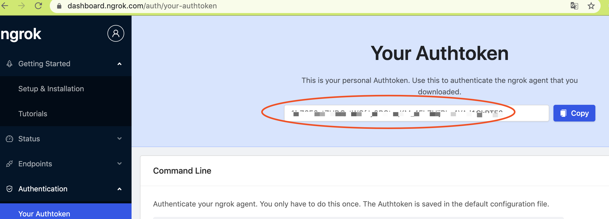

这边有一个authtoken

install一下，其实就是写到配置文件里

```shell
~/Documents/minsu/tools/ngrok authtoken ****
Shows a list of commands or help for one command
Authtoken saved to configuration file: /Users/minsu/.ngrok2/ngrok.yml
```

这时候再重新启动

```shell
~/Documents/minsu/tools/ngrok http localhost:3000

ngrok by @inconshreveable                                                                 (Ctrl+C to quit)

Session Status                online
Account                       lrain.sm@gmail.com (Plan: Free)
Version                       2.3.35
Region                        United States (us)
Web Interface                 http://127.0.0.1:4040
Forwarding                    http://63a8e00f.ngrok.io -> http://localhost:3000
Forwarding                    https://63a8e00f.ngrok.io -> http://localhost:3000

Connections                   ttl     opn     rt1     rt5     p50     p90
                              0       0       0.00    0.00    0.00    0.00
```

# References

[1] [https://developer.webex.com/docs/api/guides/webhooks](https://developer.webex.com/docs/api/guides/webhooks)

