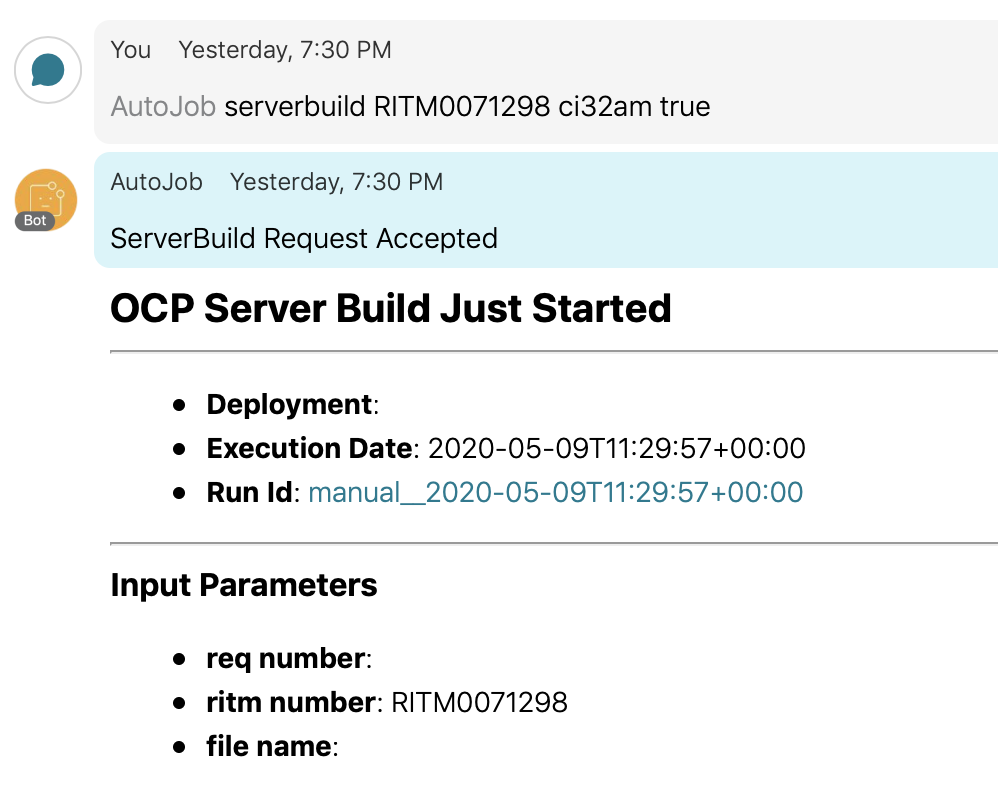
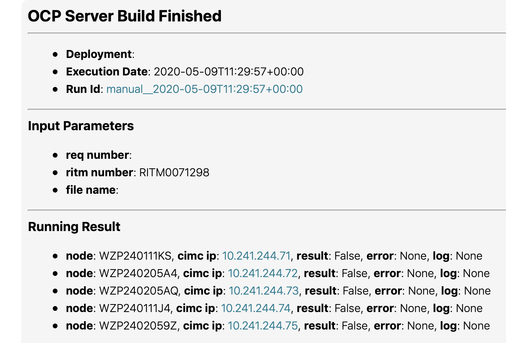
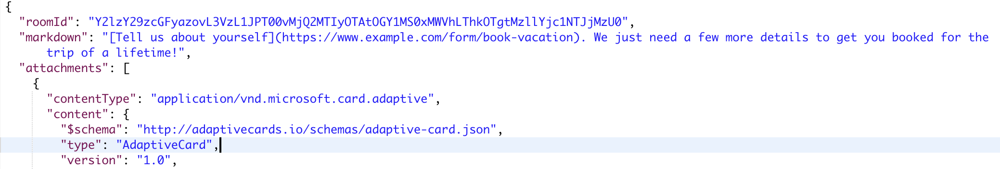
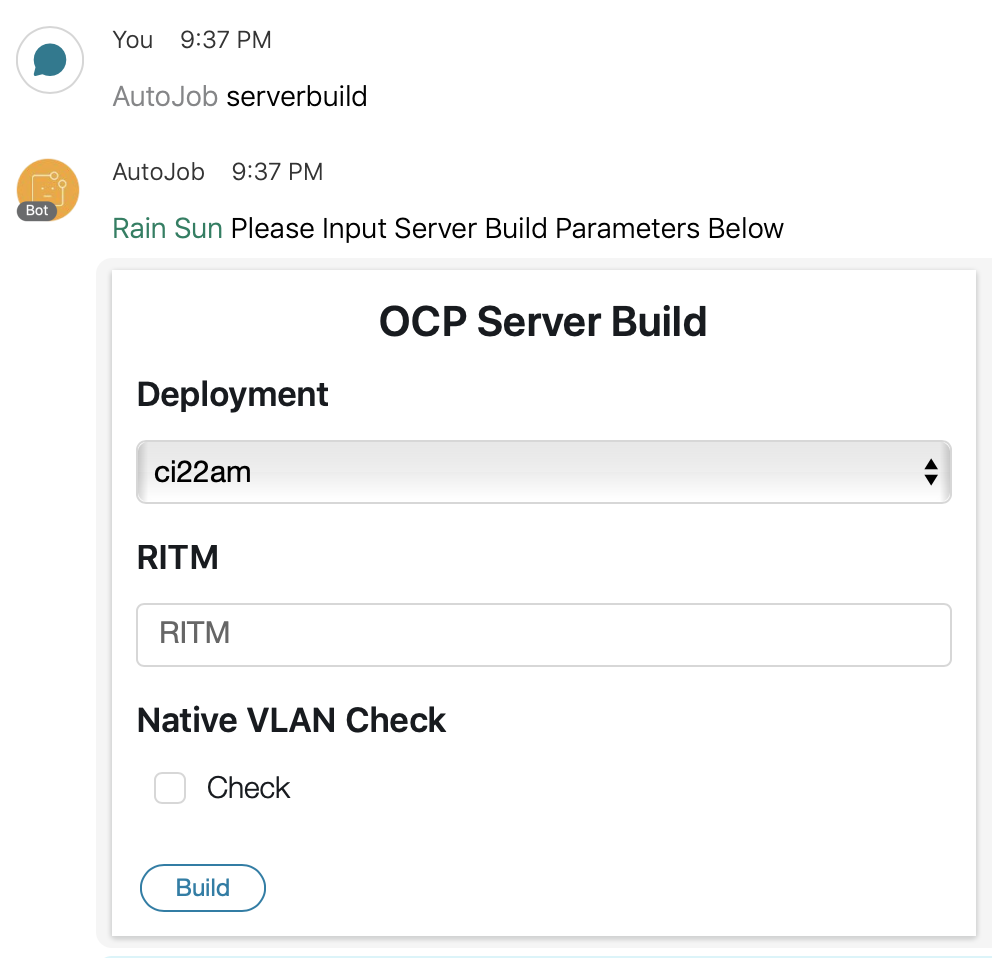

# Webex Teams Card初探

之前已经实现了通过给bot发送消息，然后bot backend触发airflow api去执行build server的流程





可是觉得这样命令行格式虽然是可以有Help提示，还是不够友好，于是想用card来触发，就看了一下card

其实也不复杂，card就是一个json格式的



类似这样request，post到https://api.ciscospark.com/v1/messages/就可以发送一个card到指定room，[这边](https://adaptivecards.io/designer/)可以试一下在线设计card

card可以填写一些input然后submit，submit的数据如果我们要get到，还需要注册一个webhook，跟之前的Message webhook不一样，虽然是同样的url，然后填写内容有变化

```json
POST https://api.ciscospark.com/v1/webhooks
{
  "name": "My Attachment Action Webhook",
  "targetUrl": "https://example.com/mywebhook",
  "resource": "attachmentActions",
  "event": "created"
}
```

这里resource必须是attachmentActions，注册之后，我们就可以收到card submit的消息

比如



这边我填好信息点submit

就能够收到这个消息，同理，发过来的是Message id，并不是具体的消息内容，要获取具体的消息内容，还需要call api才能够获取得到，比如下面的inputs，就是用户输入的信息

```json
GET /attachment/actions/Y2lzY29zcGFyazovL3VzL09SR0FOSVpBVElPTi85NmFiYzJhYS0zZGNjLTE
{
  "type": "submit",
  "messageId": "GFyazovL3VzL1BFT1BMRS80MDNlZmUwNy02Yzc3LTQyY2UtOWI4NC",
  "inputs": {
    "Name": "John Andersen",
    "Url": "https://example.com",
    "Email": "john.andersen@example.com",
    "Tel": "+1 408 526 7209"
  },
  "id": "Y2lzY29zcGFyazovL3VzL09SR0FOSVpBVElPTi85NmFiYzJhYS0zZGNjLTE",
  "personId": "Y2lzY29zcGFyazovL3VzL1BFT1BMRS83MTZlOWQxYy1jYTQ0LTRmZ",
  "roomId": "L3VzL1BFT1BMRS80MDNlZmUwNy02Yzc3LTQyY2UtOWI",
  "created": "2016-05-10T19:41:00.100Z"
}
```

我这个例子中的Inputs是"inputs": {"deployment": "ci22am", "ritm_num": "RITM0071298", "native_vlan_check": "true"}

后面的流程就跟普通bot交互一样了

# References

[1] [https://developer.webex.com/docs/api/guides/cards](https://developer.webex.com/docs/api/guides/cards)

[2] [https://github.com/CiscoDevNet/webexteamssdk](https://github.com/CiscoDevNet/webexteamssdk)

[3] [https://github.com/CiscoSE/pyadaptivecards](https://github.com/CiscoSE/pyadaptivecards)

[4] [https://adaptivecards.io/](https://adaptivecards.io/)