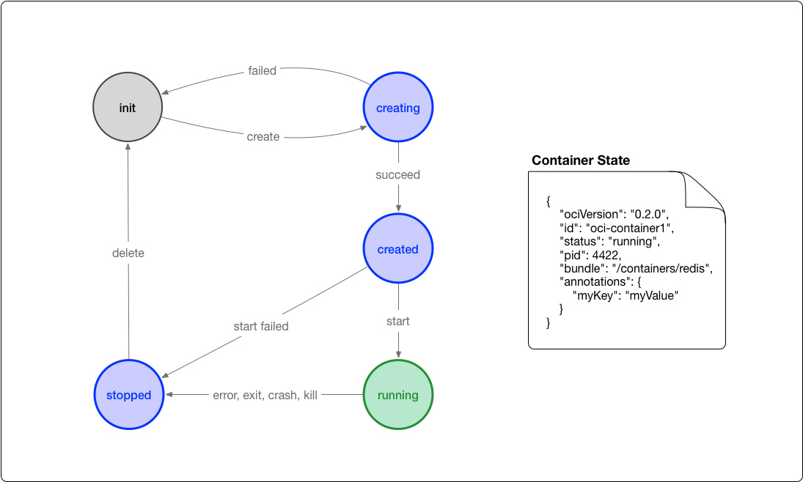

# OCI - Open Container Initiative 开放容器标准

The **Open Container Initiative** is an open governance structure for the express purpose of creating open industry standards around container formats and runtimes.

Established in June 2015 by Docker and other leaders in the container industry, the OCI currently contains two specifications: the Runtime Specification (runtime-spec) and the Image Specification (image-spec). The Runtime Specification outlines how to run a “filesystem bundle” that is unpacked on disk. At a high-level an OCI implementation would download an OCI Image then unpack that image into an OCI Runtime filesystem bundle. At this point the OCI Runtime Bundle would be run by an OCI Runtime.

OCI的使命就是推动容器标准化，容器能运行在任何的硬件和系统上，相关的组件也不必绑定在任何的容器运行时上。

它包含两个标准：

* runtime-spec： runtime标准。runtime规范概述了如何在磁盘上解压文件系统包。 - 一个标准化容器系统包应该包括所需的配置和信息，为了加载和运行容器，这个配置包含包的在根目录中的config.json里面。
* image-spec： 镜像标准

这两个协议通过 OCI runtime filesytem bundle 的标准格式连接在一起，OCI 镜像可以通过工具转换成 bundle，然后 OCI 容器引擎能够识别这个 bundle 来运行容器。在 OCI 标准下，运行一个容器的过程就是下载一个 OCI 的镜像，将其解压到某个 `Filesystem Bundle` 中，然后某个 OCI Runtime 就会运行这个 Bundle。


## image spec

OCI 容器镜像主要包括几块内容：

- [文件系统](https://github.com/opencontainers/image-spec/blob/master/layer.md)：以 layer 保存的文件系统，每个 layer 保存了和上层之间变化的部分，layer 应该保存哪些文件，怎么表示增加、修改和删除的文件等
- [config 文件](https://github.com/opencontainers/image-spec/blob/master/config.md)：保存了文件系统的层级信息（每个层级的 hash 值，以及历史信息），以及容器运行时需要的一些信息（比如环境变量、工作目录、命令参数、mount 列表），指定了镜像在某个特定平台和系统的配置。比较接近我们使用 `docker inspect <image_id>` 看到的内容
- [manifest 文件](https://github.com/opencontainers/image-spec/blob/master/manifest.md)：镜像的 config 文件索引，有哪些 layer，额外的 annotation 信息，manifest 文件中保存了很多和当前平台有关的信息
- [index 文件](https://github.com/opencontainers/image-spec/blob/master/image-index.md)：可选的文件，指向不同平台的 manifest 文件，这个文件能保证一个镜像可以跨平台使用，每个平台拥有不同的 manifest 文件，使用 index 作为索引

## runtime spec

OCI 对容器 runtime 的标准主要是指定容器的运行状态，和 runtime 需要提供的命令。下图可以是容器状态转换图：



- init 状态：不在标准中，表示没有容器存在的初始状态
- creating：使用 `create` 命令创建容器，这个过程称为创建中
- created：容器创建出来，但是还没有运行，表示镜像和配置没有错误，容器能够运行在当前平台
- running：容器的运行状态，里面的进程处于 up 状态，正在执行用户设定的任务
- stopped：容器运行完成，或者运行出错，或者 `stop` 命令之后，容器处于暂停状态。这个状态，容器还有很多信息保存在平台中，并没有完全被删除

容器标准格式也要求容器把自身运行时的状态持久化到磁盘中，这样便于外部的其它工具对此信息使用和演绎。该运行时状态以JSON格式编码存储。

在我们的docker环境中，这个状态保存在`/run/docker/runtime-runc/moby`下

```shell
[root@ci81hf1cmp001 moby]# tree /run/docker/runtime-runc/moby
/run/docker/runtime-runc/moby
├── 1099286f559fe72372a6ffb1fd6ccf664d547b1f3ef2d3115c0e897fefc0cd20
│   └── state.json
├── 2780f31d66a2850e929c39905c290af227fc3c2e864531c4d9f8ffef13c3ab7f
│   └── state.json
├── 44b879c3f8b1ee86a83f8b771603c745715fdfade9cbb293a5fd2fa466b09d0d
│   └── state.json
├── a08ecfd4e7a203977b6edfa000f5adb25a489b2912071a2e492309e06d817a74
│   └── state.json
├── a27957fbe393b517b540fe8be1dee9e2fd559e348fb5615160389f0288c494f0
│   └── state.json
├── ced504752c77ff536445c95d9162d1a8a7e0101b3f1ce4ded909e2b1ccdb95b3
│   └── state.json
└── d03be81fbeb00a1a10b52b3f287867d570d935b060cb3f91781f1c05cc2001ae
    └── state.json
    
[root@ci81hf1cmp001 moby]# docker ps
CONTAINER ID        IMAGE                                                     COMMAND                  CREATED             STATUS                    PORTS               NAMES
ced504752c77        registry-qa.webex.com/ocp/rabbitmq-exporter:v1.5          "/app"                   3 months ago        Up 3 months (unhealthy)                       prometheus_rabbitmq_exporter
44b879c3f8b1        registry-qa.webex.com/ocp/memcached-exporter:v1.5         "/bin/memcached_expo…"   3 months ago        Up 3 months                                   prometheus_memcached_exporter
1099286f559f        registry-qa.webex.com/ocp/haproxy-exporter:v1.5           "/bin/haproxy_export…"   3 months ago        Up 3 months                                   prometheus_haproxy_exporter
d03be81fbeb0        registry-qa.webex.com/ocp/mysqld-exporter:v1.5            "/bin/mysqld_exporte…"   3 months ago        Up 3 months                                   prometheus_mysqld_exporter
a27957fbe393        registry-qa.webex.com/ocp/node-exporter:v1.5              "/bin/node_exporter …"   3 months ago        Up 3 months                                   prometheus_node_exporter
a08ecfd4e7a2        registry-qa.webex.com/ocp/distributed_ocp_exporter:v1.4   "/bin/sh -c 'python3…"   4 months ago        Up 4 months                                   prometheus_distributed_ocp_exporter
2780f31d66a2        registry-qa.webex.com/ocp/libvirt-exporter:v1.4           "./libvirt_exporter …"   4 months ago        Up 4 months                                   prometheus_libvirt_exporter
```

state.json文件中包含的具体信息需要有：

- 版本信息：存放OCI标准的具体版本号。
- 容器ID：通常是一个哈希值，也可以是一个易读的字符串。在state.json文件中加入容器ID是为了便于之前提到的运行时hooks只需载入state.json就- - 可以定位到容器，然后检测state.json，发现文件不见了就认为容器关停，再执行相应预定义的脚本操作。
- PID：容器中运行的首个进程在宿主机上的进程号。
- 容器文件目录：存放容器rootfs及相应配置的目录。外部程序只需读取state.json就可以定位到宿主机上的容器文件目录。

- 容器创建：创建包括文件系统、namespaces、cgroups、用户权限在内的各项内容。
- 容器进程的启动：运行容器进程，进程的可执行文件定义在的config.json中，args项。
- 容器暂停：容器实际上作为进程可以被外部程序关停（kill），然后容器标准规范应该包含对容器暂停信号的捕获，并做相应资源回收的处理，避免孤儿进程的出现。

# runc

runc 是 docker 捐赠给 OCI 的一个符合标准的 runtime 实现，目前 docker 引擎内部也是基于 runc 构建的。

```shell
[root@ci81hf1cmp001 moby]# docker info | grep Runtime
Runtimes: runc
Default Runtime: runc
```

尝试用runc启动一个container试试

```shell
mkdir raincontainer
mkdir rootfs
docker export $(docker create busybox) | tar -C rootfs -xvf -
```

```shell
[root@ci81hf1cmp001 raincontainer]# ls -al rootfs/
total 16
drwx------ 12 root      root        137 Dec  7 03:05 .
drwx------  3 root      root         20 Dec  7 03:04 ..
drwxr-xr-x  2 root      root      12288 Dec  3 00:49 bin
drwxr-xr-x  4 root      root         43 Dec  7 03:05 dev
-rwxr-xr-x  1 root      root          0 Dec  7 03:05 .dockerenv
drwxr-xr-x  3 root      root        139 Dec  7 03:05 etc
drwxr-xr-x  2 nfsnobody nfsnobody     6 Dec  3 00:49 home
drwxr-xr-x  2 root      root          6 Dec  7 03:05 proc
drwx------  2 root      root          6 Dec  3 00:49 root
drwxr-xr-x  2 root      root          6 Dec  7 03:05 sys
drwxrwxrwt  2 root      root          6 Dec  3 00:49 tmp
drwxr-xr-x  3 root      root         18 Dec  3 00:49 usr
drwxr-xr-x  4 root      root         30 Dec  3 00:49 var
```

生成config.json配置

```shell
[root@ci81hf1cmp001 raincontainer]# runc spec
[root@ci81hf1cmp001 raincontainer]# ls
config.json  rootfs
```

这就是一个OCI runtime bundle的内容，有了这些信息，runc 就能知道怎么怎么运行容器

```shell
[root@ci81hf1cmp001 raincontainer]# runc run rain-test
/ # ls
bin   dev   etc   home  proc  root  sys   tmp   usr   var
/ # hostname
runc
/ # whoami
root
/ # pwd
/
/ # ip addr
1: lo: <LOOPBACK,UP,LOWER_UP> mtu 65536 qdisc noqueue qlen 1000
    link/loopback 00:00:00:00:00:00 brd 00:00:00:00:00:00
    inet 127.0.0.1/8 scope host lo
       valid_lft forever preferred_lft forever
    inet6 ::1/128 scope host
       valid_lft forever preferred_lft forever
       
[root@ci81hf1cmp001 ~]# runc list
ID          PID         STATUS      BUNDLE                     CREATED                          OWNER
rain-test   138537      running     /root/rain/raincontainer   2020-12-07T05:46:41.785848617Z   root
[root@ci81hf1cmp001 ~]# tree /run/runc
/run/runc
└── rain-test
    └── state.json

1 directory, 1 file
```

# Docker

docker集成了多个组件

```shell
[root@ctr-1 ~]# docker version
Client: Docker Engine - Community
 Version:           19.03.13
 API version:       1.40
 Go version:        go1.13.15
 Git commit:        4484c46d9d
 Built:             Wed Sep 16 17:02:36 2020
 OS/Arch:           linux/amd64
 Experimental:      false

Server: Docker Engine - Community
 Engine:
  Version:          19.03.13
  API version:      1.40 (minimum version 1.12)
  Go version:       go1.13.15
  Git commit:       4484c46d9d
  Built:            Wed Sep 16 17:01:11 2020
  OS/Arch:          linux/amd64
  Experimental:     false
 containerd:
  Version:          1.3.7
  GitCommit:        8fba4e9a7d01810a393d5d25a3621dc101981175
 runc:
  Version:          1.0.0-rc10
  GitCommit:        dc9208a3303feef5b3839f4323d9beb36df0a9dd
 docker-init:
  Version:          0.18.0
  GitCommit:        fec3683
  
[root@ctr-1 ~]# ls /usr/bin/docker*
/usr/bin/docker  /usr/bin/dockerd  /usr/bin/docker-init  /usr/bin/docker-proxy

[root@ctr-1 ~]# ls /usr/bin/containerd*
/usr/bin/containerd  /usr/bin/containerd-shim  /usr/bin/containerd-shim-runc-v1  /usr/bin/containerd-shim-runc-v2

[root@ctr-1 ~]# ls /usr/bin/runc
/usr/bin/runc
```

* docker client（/usr/bin/docker）是docker命令行的客户端
* dockerd （/usr/bin/dockerd）是docker命令行的daemon

所以docker的架构是client-server模式的


* containerd（/usr/bin/containerd）是真正管控容器的daemon

查看docker service `/usr/lib/systemd/system/docker.service`

```shell
BindsTo=containerd.service
After=network-online.target firewalld.service containerd.service

ExecStart=/usr/bin/dockerd -H fd:// --containerd=/run/containerd/containerd.sock
```

可以看到，Containerd实现了容器runtime，声明周期的支持和执行（create, start, stop, pause, resume, exec, signal & delete）这些特性。containerd是dockerd和runc之间的一个中间交流组件。

containerd是容器技术标准化之后的产物，为了能够兼容OCI标准，将容器运行时及其管理功能从Docker Daemon剥离。理论上，即使不运行dockerd，也能够直接通过containerd来管理容器。（当然，containerd本身也只是一个守护进程，容器的实际运行时由后面介绍的runC控制。）

为了能够支持多种 OCI Runtime，containerd 内部使用 `containerd-shim`，每启动一个容器都会创建一个新的 `containerd-shim` 进程，指定容器 ID，Bundle 目录，运行时的二进制（比如 runc）

docker 启动一个标准化容器需要经历这样的流程：


# References

[1] [https://cizixs.com/2017/11/05/oci-and-runc/](https://cizixs.com/2017/11/05/oci-and-runc/)

[2] [https://developer.aliyun.com/article/130341](https://developer.aliyun.com/article/130341)

[3] [https://xuanwo.io/2019/08/06/oci-intro/](https://xuanwo.io/2019/08/06/oci-intro/)

